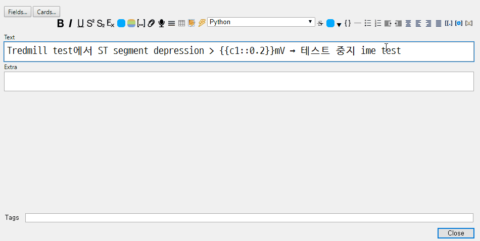

# IME Fix

Fix various issues regarding QtWebEngineView's various IME-related bugs.

## Double composition w/ `ctrl+enter`

Compositing character are doubly composed when one presses `ctrl+enter`. Addon fixes this symptoms.

